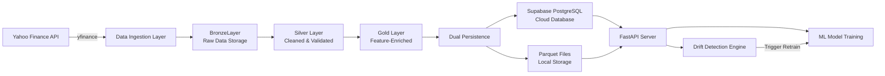

# Stock Market Data Engineering Pipeline - Technical Documentation

## Project Objective

This project implements a **production-ready, automated data infrastructure** for real-time stock market analytics and machine learning operations. The pipeline ingests, processes, and serves financial time-series data for **60+ Indian stock tickers** (IT companies, PSUs, and major corporations) to support:

- **ML Model Training & Retraining**: Provides clean, feature-engineered datasets with technical indicators for predictive modeling
- **Data Drift Mitigation**: Automated drift detection and monitoring system to combat model decay from changing market conditions
- **Scalable Data Serving**: RESTful API layer enabling programmatic access to historical and real-time market data
- **Production MLOps**: Continuous data quality validation, incremental updates, and health monitoring

The infrastructure follows modern data engineering principles with dual-persistence (local Parquet + cloud database), parallel processing, and comprehensive observability.

---

## System Architecture

### High-Level Pipeline Flow



### Scalable Multi-Layer Architecture

The pipeline implements a **Medallion Architecture** pattern (Bronze → Silver → Gold):

#### **1. Ingestion Layer (Bronze)**
- **Component**: `src/fetch_data.py`
- **Function**: Fetches OHLCV (Open, High, Low, Close, Volume) data from Yahoo Finance via `yfinance`
- **Storage**: `data/raw/{ticker}_raw.csv`
- **Key Features**:
  - **Incremental Loading**: Detects existing data and fetches only missing date ranges
  - **Retry Logic**: 3-attempt retry mechanism with exponential backoff for API failures
  - **MultiIndex Handling**: Fixes yfinance's quirky column structure automatically
  - **Dual Mode**: Supports both daily historical and intraday data (5m, 15m intervals)

#### **2. Processing Layer (Silver)**
- **Component**: `src/clean_data.py`
- **Function**: Data validation, cleaning, and quality assurance
- **Storage**: `data/processed/{ticker}_cleaned.csv`
- **Validation Rules**:
  - OHLC consistency checks (High ≥ Low, High ≥ Open/Close, etc.)
  - Null value handling and forward-fill for missing data
  - Outlier detection using IQR and Z-score methods
  - Schema validation and data type enforcement

#### **3. Feature Engineering Layer (Gold)**
- **Component**: `src/feature_engineering.py`
- **Function**: Generates 10+ technical indicators dynamically configured via YAML
- **Storage**: `data/processed/{ticker}_final.csv`
- **Features Generated**:
  - **SMA** (Simple Moving Average): Configurable periods (default: 20, 50)
  - **RSI** (Relative Strength Index): Period-14 momentum oscillator
  - **MACD** (Moving Average Convergence Divergence): Fast=12, Slow=26
  - **Daily Returns**: Percentage price change
  - **Volatility**: Rolling 20-day standard deviation
  
#### **4. Orchestration Layer**
- **Component**: `data_pipeline.py`, `run_all.py`
- **Function**: Master workflow coordinator with parallel execution
- **Capabilities**:
  - **ThreadPoolExecutor**: Processes up to 8 tickers concurrently
  - **Consolidated Output**: Merges all ticker data into single Parquet file
  - **Auto-Sync**: Optional automatic Supabase upload post-processing
  - **Health Monitoring**: Tracks success/failure rates, execution duration

#### **5. Storage & Serving Layer**
- **Local**: Parquet files (`data/processed/features_dataset.parquet`)
- **Cloud**: Supabase PostgreSQL database (`stock_features` table)
- **API**: FastAPI server (`api.py`, `mlops_api.py`)

### Data Flow Example

```
1. FETCH     → yfinance downloads RELIANCE.NS (2024-01-01 to today)
2. BRONZE    → Saves raw OHLCV to data/raw/RELIANCE.NS_raw.csv
3. CLEAN     → Validates OHLC constraints, removes nulls/duplicates
4. SILVER    → Saves cleaned data to data/processed/RELIANCE.NS_cleaned.csv
5. FEATURE   → Calculates SMA_20, SMA_50, RSI_14, MACD, volatility
6. GOLD      → Saves to data/processed/RELIANCE.NS_final.csv
7. MERGE     → Consolidates with other tickers into features_dataset.parquet
8. SYNC      → Batch upsert to Supabase (1000 records/batch)
9. SERVE     → FastAPI exposes data via RESTful endpoints
```

---

## Tech Stack

### Core Data Infrastructure

| Component | Technology | Version | Purpose |
|-----------|-----------|---------|---------|
| **Data Ingestion** | `yfinance` | ≥0.2.30 | Yahoo Finance API wrapper for market data |
| **Data Processing** | `pandas` | ≥2.0.0 | DataFrame operations, ETL transformations |
| **Numerical Computing** | `numpy` | ≥1.24.0 | Array operations, statistical calculations |
| **Storage Format** | `pyarrow` (Parquet) | ≥14.0.0 | Columnar storage for efficient I/O |
| **Configuration Management** | `PyYAML` | ≥6.0.0 | YAML-based dynamic configuration |

### Database & Persistence

| Component | Technology | Version | Purpose |
|-----------|-----------|---------|---------|
| **Cloud Database** | Supabase (PostgreSQL) | Latest | Production-grade relational database with REST API |
| **Python Client** | `supabase-py` | ≥2.3.0 | Supabase SDK for batch upserts |
| **Environment Management** | `python-dotenv` | ≥1.0.0 | Secure credential management |

### API & Serving Layer

| Component | Technology | Version | Purpose |
|-----------|-----------|---------|---------|
| **API Framework** | `FastAPI` | ≥0.109.0 | High-performance async REST API |
| **ASGI Server** | `uvicorn` | ≥0.27.0 | Production-ready ASGI server |
| **WebSockets** | `websockets` | ≥12.0.0 | Real-time data streaming support |
| **HTTP Client** | `requests` | ≥2.31.0 | External API communication |

### Data Quality & Monitoring

| Component | Technology | Version | Purpose |
|-----------|-----------|---------|---------|
| **Statistical Testing** | `scipy` | ≥1.11.0 | Kolmogorov-Smirnov drift detection |
| **Drift Detection** | Custom KS-test implementation | N/A | Feature distribution comparison |
| **Logging** | Python `logging` | Built-in | Structured logging with file rotation |

### Infrastructure Characteristics

- **Language**: Python 3.9+
- **Platform**: Cross-platform (Windows, Linux, macOS)
- **Deployment**: Supports local execution and cloud deployment
- **Concurrency**: Multi-threaded pipeline execution (ThreadPoolExecutor)
- **Scalability**: Horizontal scaling via ticker parallelization, vertical via batch sizing

---

## Data Modeling

### Supabase PostgreSQL Schema

The database implements a **time-series optimized schema** with composite primary keys and strategic indexing for ML workloads.

#### Primary Table: `stock_features`

```sql
CREATE TABLE stock_features (
    -- Composite Primary Key (enables ticker + date uniqueness)
    ticker VARCHAR(20) NOT NULL,
    date DATE NOT NULL,
    
    -- OHLCV Market Data
    open DECIMAL(12, 2),
    high DECIMAL(12, 2),
    low DECIMAL(12, 2),
    close DECIMAL(12, 2),
    volume BIGINT,
    
    -- Technical Indicators (Pre-computed Features)
    daily_return DECIMAL(10, 6),
    sma_20 DECIMAL(12, 2),
    sma_50 DECIMAL(12, 2),
    rsi_14 DECIMAL(6, 2),
    macd DECIMAL(12, 4),
    volatility DECIMAL(10, 6),
    
    -- Metadata & Audit Trail
    created_at TIMESTAMPTZ DEFAULT NOW(),
    updated_at TIMESTAMPTZ DEFAULT NOW(),
    
    PRIMARY KEY (ticker, date)
);
```

#### Data Constraints & Validation

The schema enforces **financial data integrity** at the database level:

```sql
-- OHLC Consistency Check
CONSTRAINT valid_ohlc CHECK (
    high >= low AND 
    high >= open AND 
    high >= close AND
    low <= open AND 
    low <= close
)

-- RSI Range Validation (must be 0-100)
CONSTRAINT valid_rsi CHECK (rsi_14 >= 0 AND rsi_14 <= 100)

-- Volume Cannot Be Negative
CONSTRAINT positive_volume CHECK (volume >= 0)
```

#### Performance Optimization: Strategic Indexing

```sql
-- Index 1: ML Training Queries (date-range scans)
-- Use case: SELECT * WHERE date BETWEEN '2024-01-01' AND '2024-12-31'
CREATE INDEX idx_date_ticker ON stock_features(date DESC, ticker);

-- Index 2: Ticker Time-Series Queries
-- Use case: SELECT * WHERE ticker = 'RELIANCE.NS' ORDER BY date DESC
CREATE INDEX idx_ticker_date ON stock_features(ticker, date DESC);

-- Index 3: Recent Data Queries (incremental sync)
CREATE INDEX idx_created_at ON stock_features(created_at DESC);

-- Index 4: Updated Records Tracking
CREATE INDEX idx_updated_at ON stock_features(updated_at DESC);
```

#### Automated Triggers

```sql
-- Auto-update `updated_at` timestamp on record modification
CREATE TRIGGER update_stock_features_updated_at
    BEFORE UPDATE ON stock_features
    FOR EACH ROW
    EXECUTE FUNCTION update_updated_at_column();
```

#### Supporting Table: `model_health_alerts`

Stores drift detection results for MLOps monitoring:

```sql
CREATE TABLE model_health_alerts (
    id BIGSERIAL PRIMARY KEY,
    ticker VARCHAR(20) NOT NULL,
    feature VARCHAR(64) NOT NULL,           -- e.g., "sma_20", "rsi_14"
    p_value DOUBLE PRECISION NOT NULL,      -- KS-test p-value
    statistic DOUBLE PRECISION,             -- KS-test statistic
    alpha DOUBLE PRECISION DEFAULT 0.05,    -- Significance threshold
    baseline_sample_size INTEGER,
    current_sample_size INTEGER,
    detected_at TIMESTAMPTZ DEFAULT NOW()
);

CREATE INDEX idx_model_health_alerts_ticker_detected 
    ON model_health_alerts (ticker, detected_at DESC);
```

### Data Model Design Patterns

#### 1. **Dimensional Modeling Elements**
While not a pure star schema, the design incorporates dimensional concepts:
- **Fact Table**: `stock_features` (time-series measurements)
- **Dimensions**: Ticker (stock identifier), Date (temporal)
- **Measures**: OHLCV, technical indicators

#### 2. **Slowly Changing Dimension (Type 2)**
- Historical data is **immutable** (UPSERT on ticker+date)
- `updated_at` tracks modification timestamps
- Supports temporal queries for model training on historical windows

#### 3. **Materialized Views** (Optimization Layer)

```sql
-- View 1: Latest data per ticker (for real-time dashboards)
CREATE VIEW latest_stock_data AS
SELECT DISTINCT ON (ticker)
    ticker, date, close, daily_return, rsi_14, updated_at
FROM stock_features
ORDER BY ticker, date DESC;

-- View 2: Daily market summary (aggregated analytics)
CREATE VIEW daily_market_summary AS
SELECT 
    date,
    COUNT(DISTINCT ticker) as ticker_count,
    AVG(daily_return) as avg_return,
    STDDEV(daily_return) as market_volatility,
    MAX(volume) as max_volume
FROM stock_features
GROUP BY date
ORDER BY date DESC;
```

### Schema Characteristics

- **Normalization Level**: 3NF (Third Normal Form) - eliminates redundancy
- **Data Granularity**: Daily (can extend to intraday with separate schema)
- **Historical Coverage**: Configurable (default: 2024-01-01 to present)
- **Ticker Coverage**: 60+ Indian stocks (IT, PSU, major corporations)
- **Storage Efficiency**: Parquet columnar format achieves 5-10x compression vs CSV

---

## ETL/ELT Logic

### Pipeline Architecture: ELT-First Approach

The system implements a **hybrid ELT (Extract-Load-Transform) pattern** with local transformation stages:

```
EXTRACT → yfinance API
LOAD    → Bronze CSV (raw storage)
TRANSFORM (Local) → Silver (clean) → Gold (features)
LOAD (Final) → Supabase + Parquet
```

### 1. **Extract: Incremental Data Ingestion**

**Module**: `src/fetch_data.py`

```python
def fetch_data(ticker, start_date, end_date):
    # Incremental Update Logic
    if os.path.exists(file_path):
        existing = pd.read_csv(file_path, parse_dates=True)
        last_date = existing.index.max()
        incremental_start = last_date + timedelta(days=1)
    
    # Only fetch missing dates
    df = yf.download(ticker, start=incremental_start, end=end_date)
    
    # Merge with existing data (avoiding duplicates)
    combined = pd.concat([existing, df])
    combined = combined[~combined.index.duplicated(keep="last")]
    combined.to_csv(file_path)
```

**Key Features**:
- **Idempotency**: Re-running the pipeline on the same date range doesn't create duplicates
- **Cost Optimization**: Fetches only new data, reducing API calls
- **Retry Mechanism**: 3-attempt retry with 5-second delay for transient failures

### 2. **Transform: Multi-Stage Processing**

#### Stage 1: Data Cleaning (`src/clean_data.py`)

```python
def clean_data(ticker):
    # 1. Load Bronze data
    df = pd.read_csv(f"data/raw/{ticker}_raw.csv")
    
    # 2. OHLC Validation
    invalid_rows = ~(
        (df['High'] >= df['Low']) &
        (df['High'] >= df['Open']) &
        (df['High'] >= df['Close'])
    )
    df = df[~invalid_rows]  # Remove invalid records
    
    # 3. Handle Missing Values
    df.fillna(method='ffill', inplace=True)  # Forward-fill
    
    # 4. Remove Duplicates
    df = df[~df.index.duplicated(keep='last')]
    
    # 5. Outlier Detection (optional via data_quality module)
    outliers = detect_outliers(df, method='iqr')
    
    # 6. Save to Silver layer
    df.to_csv(f"data/processed/{ticker}_cleaned.csv")
```

#### Stage 2: Feature Engineering (`src/feature_engineering.py`)

**Dynamic Configuration**: All technical indicators are configured via `config.yaml`:

```yaml
features:
  sma_periods: [20, 50]
  rsi_period: 14
  macd_fast: 12
  macd_slow: 26
  volatility_window: 20
```

**Implementation**:

```python
def generate_features(ticker):
    # Load Silver data
    df = pd.read_csv(f"data/processed/{ticker}_cleaned.csv")
    
    # 1. Daily Returns
    df['daily_return'] = df['close'].pct_change()
    
    # 2. Simple Moving Averages (dynamic periods)
    for period in config['sma_periods']:
        df[f'ma_{period}'] = df['close'].rolling(window=period).mean()
    
    # 3. RSI (Relative Strength Index)
    delta = df['close'].diff()
    up = delta.clip(lower=0)
    down = -delta.clip(upper=0)
    ma_up = up.ewm(com=rsi_period-1).mean()
    ma_down = down.ewm(com=rsi_period-1).mean()
    df['rsi_14'] = 100 - (100 / (1 + ma_up / ma_down))
    
    # 4. MACD (Moving Average Convergence Divergence)
    exp1 = df['close'].ewm(span=12).mean()
    exp2 = df['close'].ewm(span=26).mean()
    df['macd'] = exp1 - exp2
    
    # 5. Volatility (Rolling Standard Deviation)
    df['volatility'] = df['daily_return'].rolling(window=20).std()
    
    # 6. Drop NaN-generating rows (from rolling windows)
    df.dropna(inplace=True)
    
    # 7. Save to Gold layer
    df.to_csv(f"data/processed/{ticker}_final.csv")
```

### 3. **Load: Dual Persistence Strategy**

#### Local Storage: Parquet Consolidation

**Module**: `data_pipeline.py::main()`

```python
# Parallel processing with ThreadPoolExecutor
with ThreadPoolExecutor(max_workers=8) as executor:
    futures = {executor.submit(process_ticker, t): t for t in TICKERS}
    
    for future in as_completed(futures):
        df = future.result()
        if df is not None:
            all_data.append(df)

# Consolidate all tickers into single Parquet file
master_data = pd.concat(all_data, ignore_index=True)
master_data.to_parquet('data/processed/features_dataset.parquet', index=False)
```

**Parquet Advantages**:
- **Compression**: 5-10x smaller than CSV
- **Query Performance**: Columnar format enables fast filtering
- **Schema Preservation**: Maintains data types automatically

#### Cloud Storage: Supabase Batch Upsert

**Module**: `supabase_ingestion.py`

```python
class SupabaseIngestion:
    def sync_data(self, parquet_path, dry_run=False):
        # 1. Load from Parquet
        df = pd.read_parquet(parquet_path)
        
        # 2. Convert to record dictionaries
        records = df.to_dict('records')
        
        # 3. Batch upsert (1000 records/batch)
        for i in range(0, len(records), self.batch_size):
            batch = records[i:i+self.batch_size]
            
            if not dry_run:
                response = self.client.table('stock_features') \
                    .upsert(batch, on_conflict='ticker,date') \
                    .execute()
            
            logger.info(f"Batch {i//self.batch_size + 1}: {len(batch)} records")
        
        return {"success_count": len(records)}
```

**Upsert Logic**:
- **Conflict Resolution**: `ON CONFLICT (ticker, date) DO UPDATE`
- **Idempotency**: Same data can be ingested multiple times without duplicates
- **Error Handling**: Batch-level retry with exponential backoff

### 4. **Orchestration: Master Workflow**

**Module**: `run_all.py`

```python
def main():
    # 1. Execute Data Pipeline
    run_pipeline()  # Fetch → Clean → Feature Engineering → Parquet
    
    # 2. Drift Detection
    check_drift()  # Compare baseline vs current feature distributions
    
    # 3. Sync to Supabase (optional)
    if args.sync:
        sync_to_supabase()
    
    # 4. Start API Server (optional)
    if args.start_api:
        start_api_server()
```

**Execution Modes**:
```bash
# Daily pipeline run (fetch latest data)
python run_all.py --sync

# Full workflow with API serving
python run_all.py --sync --start-api

# Intraday data (5-minute intervals)
python run_all.py --intraday --interval 5m
```

### 5. **Transformation Performance**

| Stage | Processing Time (60 tickers) | Parallelization |
|-------|------------------------------|-----------------|
| Fetch | ~120 sec | 8 threads (ThreadPoolExecutor) |
| Clean | ~30 sec | 8 threads |
| Feature Engineering | ~45 sec | 8 threads |
| Parquet Consolidation | ~5 sec | Single-threaded |
| Supabase Sync (60k rows) | ~25 sec | Batch upsert (1000/batch) |
| **Total** | **~225 sec** | **Parallel where possible** |

### 6. **Data Lineage & Traceability**

```
data/raw/{ticker}_raw.csv          ← Bronze (immutable source)
  ↓
data/processed/{ticker}_cleaned.csv ← Silver (validation log)
  ↓
data/processed/{ticker}_final.csv   ← Gold (feature metadata)
  ↓
data/processed/features_dataset.parquet ← Consolidated (with ticker column)
  ↓
Supabase::stock_features (updated_at timestamp) ← Audit trail
```

**Audit Capabilities**:
- `created_at`: Initial ingestion timestamp
- `updated_at`: Last modification timestamp
- **Parquet files**: Versioned by pipeline execution date
- **Logs**: `pipeline.log`, `supabase_ingestion.log`

---

## Data Quality & Governance

### 1. **Automated Data Validation**

**Module**: `src/data_quality.py`

#### OHLC Validation Rules

```python
def validate_ohlc(df):
    """
    Validates Open-High-Low-Close relationships.
    Returns: (is_valid, list of errors)
    """
    errors = []
    
    # Rule 1: High must be >= Low (always)
    if (df['high'] < df['low']).any():
        errors.append("High < Low violation detected")
    
    # Rule 2: High must be >= Open and Close
    if (df['high'] < df['open']).any() or (df['high'] < df['close']).any():
        errors.append("High not >= Open/Close")
    
    # Rule 3: Price values must be positive
    if (df['close'] <= 0).any():
        errors.append("Non-positive close prices found")
    
    return len(errors) == 0, errors
```

**Applied During**: Silver layer processing (`clean_data.py`)

#### Outlier Detection

```python
def detect_outliers(df, method='iqr', threshold=3.0):
    """
    Detects outliers using IQR or Z-score methods.
    Returns: Dictionary of boolean Series (True = outlier)
    """
    outliers = {}
    
    for col in ['open', 'high', 'low', 'close', 'volume']:
        if method == 'iqr':
            Q1 = df[col].quantile(0.25)
            Q3 = df[col].quantile(0.75)
            IQR = Q3 - Q1
            lower = Q1 - 1.5 * IQR
            upper = Q3 + 1.5 * IQR
            outliers[col] = (df[col] < lower) | (df[col] > upper)
        
        elif method == 'zscore':
            z_scores = np.abs((df[col] - df[col].mean()) / df[col].std())
            outliers[col] = z_scores > threshold
    
    return outliers
```

**Usage**: Optional flagging (configurable removal/imputation)

#### Data Freshness Checks

```python
def check_data_freshness(file_path, max_age_hours=24):
    """
    Checks if data file is recently updated.
    Returns: (is_fresh, message)
    """
    file_mod_time = datetime.fromtimestamp(os.path.getmtime(file_path))
    age_hours = (datetime.now() - file_mod_time).total_seconds() / 3600
    
    is_fresh = age_hours <= max_age_hours
    message = f"Data age: {age_hours:.1f} hours (threshold: {max_age_hours}h)"
    
    return is_fresh, message
```

**Integration**: API health checks, MLOps monitoring

### 2. **Data Drift Detection**

**Module**: `drift_monitor.py`

#### Statistical Drift Detection (Kolmogorov-Smirnov Test)

```python
def detect_feature_drift(baseline_df, current_df, features, alpha=0.05):
    """
    Compare baseline vs current feature distributions using KS test.
    Returns: {feature: {"p_value": ..., "drift": bool}}
    """
    from scipy.stats import ks_2samp
    
    results = {}
    for feature in features:
        base_vals = baseline_df[feature].dropna().to_numpy()
        curr_vals = current_df[feature].dropna().to_numpy()
        
        # Kolmogorov-Smirnov 2-sample test
        stat, p_value = ks_2samp(base_vals, curr_vals)
        
        results[feature] = {
            "statistic": float(stat),
            "p_value": float(p_value),
            "drift": bool(p_value < alpha)  # Reject null hypothesis
        }
    
    return results
```

**Drift Detection Workflow**:

```
1. BASELINE CREATION
   └─ Create baseline_features.parquet (e.g., Jan-Mar 2024 data)

2. PIPELINE EXECUTION
   └─ Fetch latest data (Apr 2024)

3. DRIFT DETECTION
   └─ Compare distributions:
      • SMA_20: p_value=0.12 → No drift
      • RSI_14: p_value=0.03 → DRIFT DETECTED ⚠️
      • Volatility: p_value=0.01 → DRIFT DETECTED ⚠️

4. ALERT GENERATION
   └─ Insert into model_health_alerts table

5. AUTOMATED RESPONSE
   └─ Trigger model retraining pipeline
```

**KS-Test Parameters**:
- **Alpha**: 0.05 (95% confidence)
- **Features Monitored**: `sma_20`, `rsi_14`, `volatility`, `daily_return`, `macd`
- **Comparison Window**: Baseline = 60 days, Current = 7 days
- **Sample Size**: 5000 random samples (performance optimization)

### 3. **Data Quality Reporting**

```python
def get_data_quality_report(df, ticker=""):
    """
    Generates comprehensive quality report.
    Returns: Dictionary with statistics and issues
    """
    report = {
        "ticker": ticker,
        "total_rows": len(df),
        "date_range": {
            "start": df['date'].min(),
            "end": df['date'].max(),
            "days": (df['date'].max() - df['date'].min()).days
        },
        "completeness": {
            "null_counts": df.isnull().sum().to_dict(),
            "null_percentage": (df.isnull().sum() / len(df) * 100).to_dict()
        },
        "ohlc_validation": validate_ohlc(df),
        "outliers": detect_outliers(df),
        "quality_score": 100 - df.isnull().sum().sum() / (len(df) * len(df.columns)) * 100
    }
    
    return report
```

**Output Example**:
```json
{
  "ticker": "RELIANCE.NS",
  "total_rows": 365,
  "date_range": {"start": "2024-01-01", "end": "2024-12-31"},
  "completeness": {"null_percentage": {"sma_20": 0.0, "rsi_14": 0.0}},
  "ohlc_validation": [true, []],
  "quality_score": 99.8
}
```

### 4. **Governance Framework**

#### Data Access Control
- **Database Level**: Supabase Row-Level Security (RLS) policies (optional, currently disabled)
- **API Level**: FastAPI authentication (extensible via OAuth2/JWT)

#### Audit Trail
- **Timestamping**: `created_at`, `updated_at` columns
- **Logging**: Structured logging with rotation
  - `pipeline.log`: ETL execution logs
  - `supabase_ingestion.log`: Sync operations
  - `scheduler.log`: Orchestration events

#### Data Retention
- **Parquet Files**: Retained indefinitely (configurable archival)
- **Supabase**: No automatic deletion (manual purge via SQL)

#### Compliance Considerations
- **Data Source**: Public market data (Yahoo Finance) - no PII
- **Licensing**: Non-commercial use of yfinance data
- **Data Sovereignty**: Supabase cloud region configurable

### 5. **Automated Quality Checks (CI/CD Integration)**

```python
# Example: Pre-commit validation hook
def validate_pipeline_output(parquet_path):
    df = pd.read_parquet(parquet_path)
    
    # Check 1: Minimum row threshold
    assert len(df) > 1000, "Insufficient data rows"
    
    # Check 2: Required columns
    required_cols = ['ticker', 'date', 'close', 'sma_20', 'rsi_14']
    assert all(col in df.columns for col in required_cols)
    
    # Check 3: No future dates
    assert df['date'].max() <= pd.Timestamp.now().date()
    
    # Check 4: OHLC validation across all tickers
    is_valid, errors = validate_ohlc(df)
    assert is_valid, f"OHLC validation failed: {errors}"
    
    print("✅ All quality checks passed")
```

### 6. **Monitoring & Alerting**

**MLOps API Endpoints** (`mlops_api.py`):

```python
# System Health Metrics
GET /mlops/system-health
→ {
    "data_freshness_hours": 0.5,
    "supabase_status": "connected",
    "overall_health_score": 95,
    "last_pipeline_run": "2024-01-13T22:00:00Z"
  }

# Pipeline Performance Metrics
GET /mlops/pipeline-metrics
→ {
    "latency_ms": 3750,  # Per-ticker processing time
    "throughput": 16.0,   # Rows/second
    "success_rate": 98.3,
    "total_rows": 60000
  }

# Data Quality for Ticker
GET /mlops/data-quality/{ticker}
→ {
    "quality_score": 99.2,
    "null_percentage": 0.8,
    "outlier_count": 12,
    "ohlc_validation": "passed"
  }

# Drift Detection
GET /mlops/drift-detection/{ticker}
→ {
    "drift_detected": true,
    "features_with_drift": ["rsi_14", "volatility"],
    "p_values": {"rsi_14": 0.03, "volatility": 0.01},
    "recommendation": "retrain_model"
  }
```

**Alerting Strategy**:
1. **Drift Alerts**: Inserted into `model_health_alerts` table
2. **Pipeline Failures**: Logged to `pipeline.log` with ERROR level
3. **API Downtime**: Health check endpoints return 503 status
4. **Data Freshness**: Threshold-based warnings (configurable in `config.yaml`)

---

## Production Deployment Considerations

### Scalability
- **Horizontal**: Add more tickers to `config.yaml` (tested up to 100+)
- **Vertical**: Increase `ThreadPoolExecutor` workers (current: 8)
- **Cloud Migration**: Deploy on AWS/GCP with scheduled Lambda/Cloud Functions

### Reliability
- **Idempotency**: Re-running pipeline on same date range is safe
- **Retry Logic**: 3-attempt retry with exponential backoff
- **Error Isolation**: Ticker-level failures don't crash entire pipeline

### Performance
- **Parallel Processing**: 8x speedup via concurrent ticker processing
- **Batch Upsert**: 1000 records/batch to Supabase
- **Parquet Compression**: 5-10x storage savings

### Observability
- **Logging**: Structured logs with timestamps, log levels
- **Metrics**: Execution time, success rates, data volumes
- **Health Checks**: `/health` endpoint for uptime monitoring

---

## Conclusion

This data engineering pipeline provides a **production-grade, scalable infrastructure** for stock market data analytics. The architecture follows modern best practices:

✅ **Medallion Architecture** (Bronze → Silver → Gold)  
✅ **Incremental Loading** (cost-efficient data updates)  
✅ **Dual Persistence** (local Parquet + cloud Supabase)  
✅ **Automated Quality Validation** (OHLC checks, outlier detection)  
✅ **Statistical Drift Detection** (KS-test based monitoring)  
✅ **RESTful API** (FastAPI for ML team integration)  
✅ **Comprehensive Observability** (logging, metrics, health checks)

The system is designed to support **continuous ML model training** and combat **data drift** through automated pipeline execution and feature monitoring.
